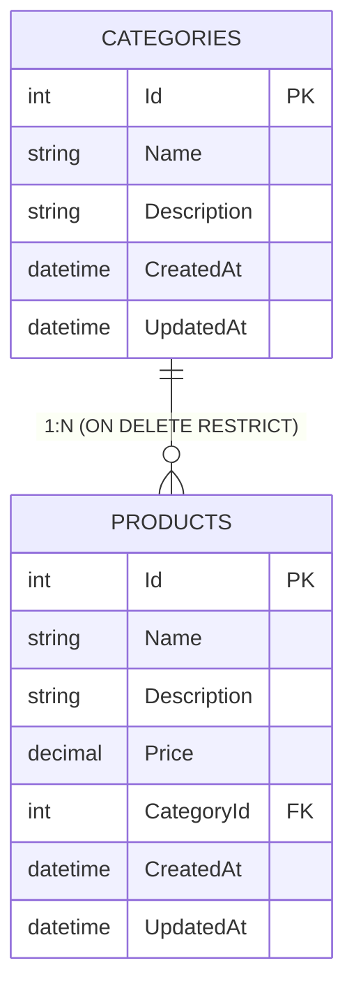
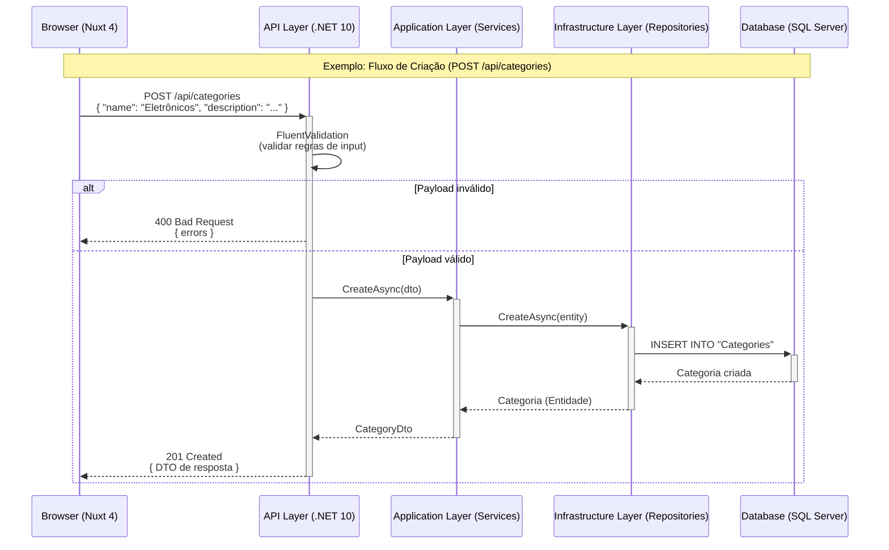
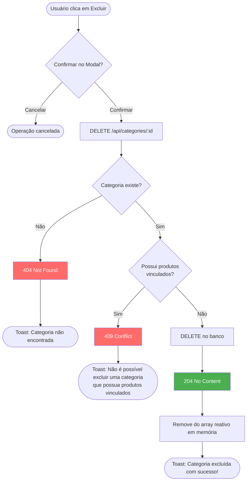

# ZdzcStock — Gestão de Catálogo Full Stack

**Desafio Técnico — ZDZCloud 2026**

Sistema moderno de gestão de catálogo de Produtos e Categorias desenvolvido de ponta a ponta (*Full Stack*). O projeto demonstra práticas de arquitetura limpa no back-end e um desenvolvimento reativo e performático no front-end.

---

## 🚀 Índice

1. [Sobre o Projeto](#-sobre-o-projeto)
2. [Clonação do Repositório](#-clonação-do-repositório)
3. [Stack Tecnológica](#-stack-tecnológica)
4. [Arquitetura Geral e Diagramas](#-arquitetura-geral-e-diagramas)
5. [Inicialização dos Projetos](#-inicialização-dos-projetos)
6. [Guias de Documentação Detalhada](#-guias-de-documentação-detalhada)

---

## 📦 Sobre o Projeto

O **ZdzcStock** é um ecossistema projetado para gerenciar inventários comerciais de forma eficiente. Ele permite o cadastro, edição, exclusão e visualização de categorias de produtos e seus itens vinculados, garantindo a integridade dos dados e uma experiência de usuário (UX) de alto nível:

* **Integração de Dados Real:** Persistência no SQL Server 2022 rodando em container Docker.
* **Integridade Referencial:** Tratamento inteligente contra a exclusão acidental de categorias que possuem produtos ativos vinculados.
* **Interface Reativa:** Interface Nuxt 4 construída com Vuetify 3 que atualiza listas e elementos dinamicamente sem recarregamento da página.
* **Segurança e Proteção:** Implementação de limite de requisições (*Rate Limiting*) e políticas de CORS no back-end.

---

## 👥 Clonação do Repositório

Para obter uma cópia local deste projeto, clone o repositório utilizando o Git:

```bash
git clone https://github.com/eliezerlobaton/zdzcStock.git
cd zdzcStock
```

---

## 🛠️ Stack Tecnológica

| Camada | Tecnologia | Descrição / Papel |
|---|---|---|
| **Back-end** | .NET 10 (C#) | API RESTful rápida e fortemente tipada. |
| **ORM** | Entity Framework Core 10 | Camada de mapeamento de dados com migrations automáticas. |
| **Database** | SQL Server 2022 | Banco relacional robusto para armazenamento permanente. |
| **Validations** | FluentValidation 11 | Validação desacoplada de dados na API. |
| **Front-end** | Nuxt 4 (Vue 3 · TS) | Interface SPA ágil usando a Composition API. |
| **UI Library** | Vuetify 3 | Componentes de design modernos com suporte responsivo. |
| **Containers** | Docker & Compose | Provisionamento simplificado da base de dados. |

---

## 📐 Arquitetura Geral e Diagramas

### 1. Arquitetura do Back-end (Clean Architecture)
O backend é estruturado em 4 camadas com dependência estrita de fora para dentro:
* **API Layer:** Controllers HTTP, CORS, tratamento de exceções global e Rate Limiting.
* **Application Layer:** Definições de DTOs, validadores FluentValidation e serviços de casos de uso.
* **Domain Layer:** Entidades de domínio (`Product`, `Category`), interfaces de repositórios e Result Pattern.
* **Infrastructure Layer:** Contexto do banco (`AppDbContext`), persistência e repositórios EF Core.

### 2. Diagrama de Relacionamento (BD Relacional)


### 3. Diagrama de Fluxo de Trabalho (Operações CRUD)
Demonstra o caminho de uma requisição trafegando pelas camadas da Clean Architecture:



### 4. Diagrama de Fluxo (Exclusão com Integridade Referencial)
Demonstra a proteção lógica contra a exclusão acidental de categorias vinculadas a produtos ativos:



---

## 🚀 Inicialização dos Projetos

As instruções passo a passo para configurar e iniciar cada uma das partes da aplicação estão documentadas individualmente nos seus respectivos diretórios:

* 🖥️ **[Guia de Execução do Back-end e Banco (Docker)](./backend/README.md)**: Passos para levantar o container do banco SQL Server e rodar a API .NET 10.
* 🎨 **[Guia de Execução do Front-end (Nuxt)](./frontend/README.md)**: Passos para instalar as dependências e iniciar o servidor de desenvolvimento da interface visual.