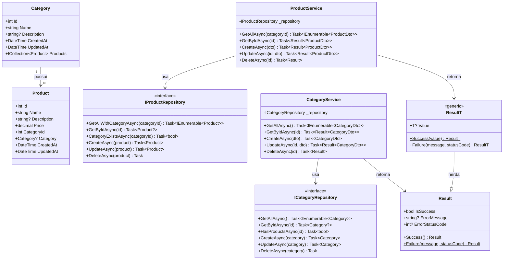
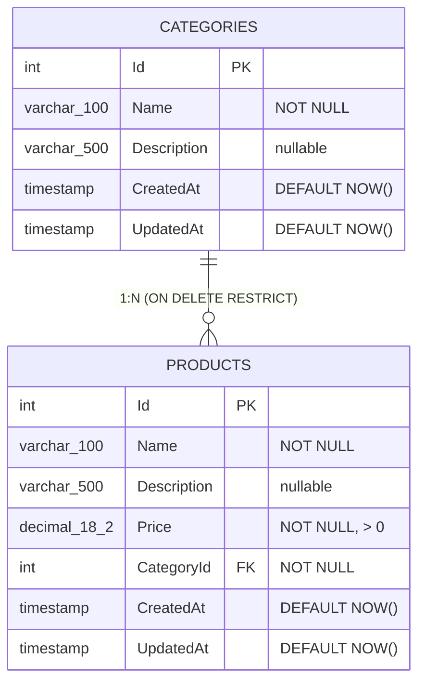

# Backend — ZdzcStock

API RESTful para a gestão do catálogo de Produtos e Categorias, desenvolvida com **C# / .NET 10**, **Entity Framework Core 10** e **SQL Server 2022**.

---

## 🚀 Índice

- [Tecnologias Utilizadas](#-tecnologias-utilizadas)
- [Estrutura do Projeto](#-estrutura-do-projeto)
- [Pré-requisitos](#-pré-requisitos)
- [Instalação e Execução](#-instalação-e-execução)
- [Decisões de Arquitetura](#-decisões-de-arquitetura)
  - [Clean Architecture](#clean-architecture)
  - [Result Pattern](#result-pattern)
  - [Tratamento Global de Exceções](#tratamento-global-de-exceções)
- [Diagramas Técnicos](#-diagramas-técnicos)
  - [Diagrama de Classes](#1-diagrama-de-classes)
  - [Diagrama Entidade-Relacionamento](#2-diagrama-entidade-relacionamento-banco-de-dados)
- [Configuração de Banco e Migrations](#-configuração-de-banco-e-migrations)
- [Endpoints da API](#-endpoints-da-api)
- [Validações e Testes](#-validações-e-testes)

---

## 🛠️ Tecnologias Utilizadas

* **.NET 10**: Plataforma estável e moderna de execução do C#.
* **ASP.NET Core 10**: Framework web para criação dos endpoints REST com suporte nativo a Rate Limiting.
* **Entity Framework Core 10**: ORM utilizado para gerenciar a persistência no banco de dados através de repositórios.
* **FluentValidation**: Biblioteca dedicada a desacoplar regras de validação estrutural da API.
* **Scalar**: Interface visual moderna e interativa para documentação da API baseada em OpenAPI (`/scalar/v1`) com tema *DeepSpace*.
* **xUnit**: Framework para testes unitários com suporte a simulação através do Moq e asserções com FluentAssertions.

---

## 📂 Estrutura do Projeto (`src/`)

O código-fonte do backend está estruturado em 4 projetos principais, organizada exatamente da seguinte forma:

```text
backend/
├── ZdzcStock.slnx            # Arquivo de Solução XML do C# contendo todos os projetos
├── compose.yml               # Configuração do Docker Compose para o banco de dados SQL Server
├── src/
│   ├── ZdzcStock.Domain/     # Core da aplicação (Zero dependências externas)
│   │   ├── Common/
│   │   │   └── Result.cs     # Estrutura Result Pattern para respostas tipadas
│   │   ├── Entities/
│   │   │   ├── Category.cs   # Entidade com relacionamento restrict para produtos
│   │   │   └── Product.cs    # Entidade representando as propriedades do produto
│   │   ├── Interfaces/
│   │   │   ├── ICategoryRepository.cs # Contrato de acesso a dados de categoria
│   │   │   └── IProductRepository.cs  # Contrato de acesso a dados de produto
│   │   └── ZdzcStock.Domain.csproj
│   │
│   ├── ZdzcStock.Application/# Regras de aplicação: DTOs, Validadores e Serviços
│   │   ├── DTOs/
│   │   │   ├── CategoryDto.cs
│   │   │   ├── CreateCategoryDto.cs
│   │   │   ├── CreateProductDto.cs
│   │   │   ├── ProductDto.cs
│   │   │   ├── UpdateCategoryDto.cs
│   │   │   └── UpdateProductDto.cs
│   │   ├── Services/
│   │   │   ├── CategoryService.cs
│   │   │   └── ProductService.cs
│   │   ├── Validators/
│   │   │   ├── CreateCategoryDtoValidator.cs
│   │   │   ├── CreateProductDtoValidator.cs
│   │   │   ├── UpdateCategoryDtoValidator.cs
│   │   │   └── UpdateProductDtoValidator.cs
│   │   └── ZdzcStock.Application.csproj
│   │
│   ├── ZdzcStock.Infrastructure/# Infraestrutura de persistência de dados
│   │   ├── Data/
│   │   │   └── AppDbContext.cs        # Contexto do Banco EF Core e mapeamentos Fluent API
│   │   ├── DependencyInjection.cs     # Injeção de repositórios e contextos no container de DI
│   │   ├── Migrations/
│   │   │   ├── 20260601035220_Initial.cs
│   │   │   ├── 20260601035220_Initial.Designer.cs
│   │   │   └── AppDbContextModelSnapshot.cs
│   │   ├── Repositories/
│   │   │   ├── CategoryRepository.cs  # Acesso a dados com EF Core
│   │   │   └── ProductRepository.cs   # Acesso a dados com EF Core
│   │   └── ZdzcStock.Infrastructure.csproj
│   │
│   └── ZdzcStock.Api/        # Camada de entrada HTTP e Controllers
│       ├── Controllers/
│       │   ├── CategoryController.cs  # Controller para CRUD de Categorias (api/Categories)
│       │   └── ProductsController.cs  # Controller para CRUD de Produtos (api/products)
│       ├── Middleware/
│       │   └── GlobalExceptionHandler.cs # Captura exceções e gera respostas ProblemDetails
│       ├── Program.cs                 # Arquivo de composição principal do pipeline da API
│       ├── appsettings.json           # Configurações gerais de banco e CORS
│       ├── appsettings.Development.json
│       ├── ZdzcStock.Api.csproj
│       └── ZdzcStock.Api.http
└── tests/
    └── ZdzcStock.Tests/      # Projeto de Testes Unitários do backend
        ├── Services/
        │   ├── CategoryServiceTests.cs
        │   └── ProductServiceTests.cs
        └── ZdzcStock.Tests.csproj
```

---

## 💻 Pré-requisitos
* **.NET 10 SDK** instalado.
* **Docker** e **Docker Compose** instalados para rodar o banco de dados.
* CLI do Entity Framework instalada globalmente:
  ```bash
  dotnet tool install --global dotnet-ef
  ```

---

## 🚀 Instalação e Execução

### 1. Inicializar o Banco de Dados (SQL Server via Docker Compose)
Navegue até a pasta `backend/` e inicie o serviço de banco de dados em segundo plano utilizando o Docker Compose:
```bash
docker compose up -d
```
*Isso criará o container chamado `zstock_db` utilizando a imagem oficial do SQL Server 2022, mapeando a porta padrão `1433` e persistindo os dados no volume local `sqlserver_data`.*

### 2. Restaurar dependências
Na raiz do diretório `backend/`, restaure os pacotes NuGet do projeto:
```bash
dotnet restore
```

### 3. Aplicar as Migrações do Banco
Rode as migrações para criar a estrutura de tabelas no banco de dados `stock`:
```bash
dotnet ef database update \
  --project src/ZdzcStock.Infrastructure \
  --startup-project src/ZdzcStock.Api
```

### 4. Executar a API
Inicie o servidor de desenvolvimento do backend:
```bash
dotnet run --project src/ZdzcStock.Api
```

A API estará disponível no endereço: **http://localhost:5285** *(porta padrão definida no `launchSettings.json` para o ambiente de desenvolvimento — pode variar conforme o perfil de execução)*
* **Scalar UI (Documentação)**: http://localhost:5285/scalar/v1
* **Especificação OpenAPI JSON**: http://localhost:5285/openapi/v1.json

---

## 📐 Decisões de Arquitetura

### Clean Architecture
O fluxo de dependências é estrito de fora para dentro. As camadas externas conhecem as internas, mas as internas (Domain) são totalmente puras e livres de dependências externas de infraestrutura. Isso isola as regras de negócio de acoplamento a provedores de banco de dados ou detalhes da web.

### Result Pattern
O projeto adota o **Result Pattern** para manipulação de erros esperados de domínio (ex: violação de regra de negócio, entidade não encontrada). Em vez de lançar e capturar exceções custosas de runtime, as funções retornam um objeto `Result<T>` contendo o status de sucesso ou a falha estruturada com seu respectivo código HTTP correspondente.

### Tratamento Global de Exceções
Erros inesperados (ex: falhas de infraestrutura ou de runtime) são interceptados globalmente por um middleware estruturado a partir da interface `IExceptionHandler` do .NET 10. Ele formata as respostas no padrão de mercado `ProblemDetails` com status HTTP 500, garantindo segurança ao ocultar detalhes do servidor.

---

## 📊 Diagramas Técnicos

### 1. Diagrama de Classes
Classes de negócios e contratos de persistência definidos no core da aplicação:



### 2. Diagrama Entidade-Relacionamento (Banco de Dados)
Representa o esquema de banco relacional configurado por meio do Fluent API:



---

## 💾 Configuração de Banco e Migrations

As migrations registram o histórico de evolução da base SQL. Para atualizar ou reverter migrações manualmente:

```bash
# 1. Adicionar nova migração após alterar entidades ou mapeamento Fluent API
dotnet ef migrations add <NOME_DA_MIGRACAO> \
  --project src/ZdzcStock.Infrastructure \
  --startup-project src/ZdzcStock.Api

# 2. Aplicar alterações pendentes no banco de dados local
dotnet ef database update \
  --project src/ZdzcStock.Infrastructure \
  --startup-project src/ZdzcStock.Api
```

---

## 🌱 Seeder de Dados para Desenvolvimento (Opcional)

Para popular a base de dados com 10 categorias e 100 produtos pré-cadastrados, utilizamos um script SQL puro (`seeder.sql`) para garantir isolamento total e não gerar resíduos de código no Entity Framework. O script é idempotente (não duplica dados) e seguro.

Para executá-lo via Docker (garanta que o container `zstock_db` esteja rodando):

```bash
# 1. Copie o arquivo para o container
docker cp seeder.sql zstock_db:/seeder.sql

# 2. Execute utilizando a CLI do SQL Server nativa do container
docker exec -it zstock_db /opt/mssql-tools18/bin/sqlcmd \
  -S localhost -U sa -P Admin123 -No -i /seeder.sql
```

---

## 🛜 Endpoints da API

### Categorias (`api/Categories`)
* `GET /api/categories` — Listagem total das categorias.
* `GET /api/categories/{id}` — Detalhe individual de uma categoria.
* `POST /api/categories` — Criação de categoria (Requer `CreateCategoryDto`).
* `PUT /api/categories/{id}` — Atualização cadastral da categoria.
* `DELETE /api/categories?id={id}` — Remoção (Bloqueado via HTTP 409 caso a categoria possua produtos vinculados). O `id` é recebido como parâmetro de query, conforme a definição do `[HttpDelete]` sem segmento de rota no controller.

### Produtos (api/products)
* `GET /api/products` — Listagem geral de produtos (suporta filtro opcional via query: `?categoryId=id`).
* `GET /api/products/{id}` — Detalhe individual de um produto.
* `POST /api/products` — Criação de produto (Requer `CreateProductDto` plano contendo dados básicos e `CategoryId`).
* `PUT /api/products/{id}` — Atualização de produto (Requer `UpdateProductDto` plano).
* `DELETE /api/products/{id}` — Remoção física de produto.

---

## 🧪 Validações e Testes

Todas as requisições enviadas ao controller de escrita são validadas de forma desacoplada no FluentValidation, retornando HTTP 400 em caso de dados inválidos.

Para rodar todos os testes automatizados de negócio do xUnit:
```bash
dotnet test
```
