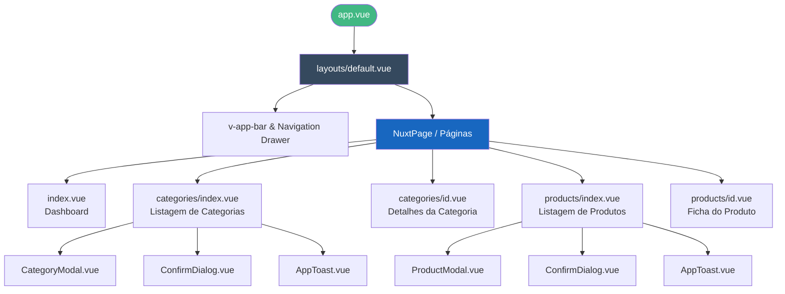
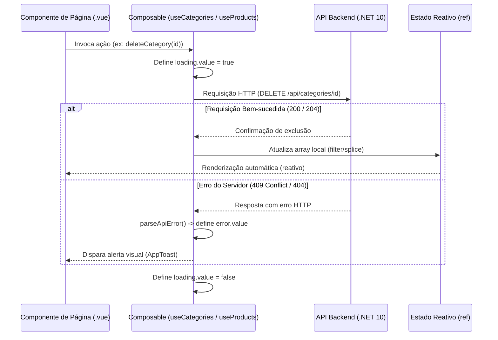

# Frontend — ZdzcStock

Interface web interativa para a gestão do catálogo de Produtos e Categorias, desenvolvida com **Nuxt 4**, **Vue 3 (Composition API)** e **Vuetify 3**.

---

## 🚀 Índice

- [Tecnologias Utilizadas](#-tecnologias-utilizadas)
- [Estrutura do Projeto](#-estrutura-do-projeto)
- [Inicialização e Configuração](#-inicialização-e-configuração)
- [Decisões de Arquitetura](#-decisões-de-arquitetura)
  - [Hierarquia de Componentes](#1-hierarquia-de-componentes)
  - [Fluxo de Estado e Dados](#2-fluxo-de-estado-e-dados)
  - [Gestão de Estado Reativo Local (Composables)](#3-gestão-de-estado-reativo-local-composables)
  - [Tratamento de Erros Fortemente Tipado](#4-tratamento-de-erros-fortemente-tipado)
- [Detalhes das Páginas e Critérios de Aceitação](#-detalhes-das-páginas-e-critérios-de-aceitação)
- [Especificações de Componentes Reutilizáveis](#-especificações-de-componentes-reutilizáveis)

---

## 🛠️ Tecnologias Utilizadas

* **Nuxt 4**: Framework base SPA que gerencia o roteamento automático reativo por meio da estrutura de pastas em `app/pages`.
* **Vue 3**: Desenvolvimento modular utilizando a **Composition API** com blocos otimizados `<script setup lang="ts">`.
* **Vuetify 3**: Biblioteca para componentes de interface visual baseada em Material Design 3, integrada ao Nuxt via `vuetify-nuxt-module` (v0.19.5) e configurada com tema escuro dinâmico.
* **TypeScript**: Tipagem estrita (`strict: true`) em todos os arquivos de código, eliminando a utilização de tipos implícitos `any`.
* **ofetch**: Cliente de requisições HTTP nativo integrado ao ciclo de vida do Nuxt.

---

## 📂 Estrutura do Projeto (`app/`)

O código-fonte do frontend está encapsulado em conformidade com as regras do **Nuxt 4** (utilizando a pasta central `app/`):

```text
frontend/app/
├── components/
│   ├── AppToast.vue          # Feedback visual para o usuário (Sucesso / Erro)
│   ├── CategoryModal.vue     # Modal de formulário para criação e edição de categorias
│   ├── ConfirmDialog.vue     # Diálogo de confirmação de exclusão (evita ações acidentais)
│   └── ProductModal.vue      # Modal de formulário para criação e edição de produtos
├── composables/
│   ├── useCategories.ts      # Gerenciamento de estado local e chamadas HTTP de categorias
│   └── useProducts.ts        # Gerenciamento de estado local e chamadas HTTP de produtos
├── layouts/
│   └── default.vue           # Layout com Toolbar e Navigation Drawer reativo
├── pages/
│   ├── index.vue             # Dashboard principal com métricas financeiras e de volume
│   ├── categories/
│   │   ├── index.vue         # Lista principal de categorias e controle CRUD
│   │   └── [id].vue          # Tela dinâmica: detalhes e produtos associados à categoria
│   └── products/
│       ├── index.vue         # Lista principal de produtos e controle CRUD
│       └── [id].vue          # Tela dinâmica: ficha completa do produto (nome, preço, categoria vinculada e descrição)
├── types/
│   └── index.ts              # Modelos e interfaces de tipos do negócio
└── utils/
    └── parserApiError.ts     # Utilitário helper para desmembrar mensagens de erro da API
```

---

## 💻 Inicialização e Configuração

### Requisitos Prévios:
* **Bun** >= 1.0 (ou Node.js equivalente)
* A API do Backend rodando em: `http://localhost:5285`

### Configuração do Ambiente:
Crie um arquivo `.env` na raiz do diretório `frontend/`:
```env
NUXT_PUBLIC_API_URL=http://localhost:5285
```

### Executar em Desenvolvimento:
```bash
# 1. Instalar dependências
bun install

# 2. Iniciar servidor local
bun run dev
```
A aplicação será servida em: **http://localhost:3000**

---

## 📐 Decisões de Arquitetura

### 1. Hierarquia de Componentes
Demonstra como os elementos visuais e modais se estruturam a partir da raiz do Nuxt:



### 2. Fluxo de Estado e Dados
Ilustra a comunicação reativa unidirecional entre a interface, os composables controladores de estado e a API:



### 3. Gestão de Estado Reativo Local (Composables)
Para simplificar a arquitetura e otimizar o consumo de recursos, **optou-se por não utilizar gerenciadores de estado globais (como o Pinia)**. Em vez disso, o estado é gerenciado localmente de forma modular através de composables do Vue (`useCategories` e `useProducts`).

Após cada operação de escrita bem-sucedida (`PUT` ou `DELETE`), o estado em memória é atualizado reativamente na hora. Isso evita requisições `GET` de recarregamento adicionais ao servidor, proporcionando uma experiência instantânea ao usuário:
```typescript
// Sincronização reativa em memória ao excluir:
categories.value = categories.value.filter(c => c.id !== id);

// Sincronização reativa em memória ao editar:
const idx = categories.value.findIndex(c => c.id === id);
if (idx !== -1) categories.value[idx] = updatedCategory;
```

### 4. Tratamento de Erros Fortemente Tipado
As requisições HTTP capturam exceções e erros de conexão mapeando-os estritamente para `FetchError<ApiErrorResponse>` nativos da biblioteca `ofetch`. O helper `parseApiError` extrai mensagens amigáveis retornadas pela API para exibição por meio do `AppToast`, contornando blocos inseguros como `catch (err: any)`.

---

## 📄 Detalhes das Páginas e Critérios de Aceitação (AC)

### 1. Dashboard (`/`)
Apresenta três cartões informativos carregados em paralelo via `Promise.all` para evitar atrasos na interface:
* Total de Categorias cadastradas.
* Total de Produtos em estoque.
* Valor total acumulado do estoque de produtos.

### 2. Gestão de Categorias (`/categories/index.vue`)
* **Listagem e Busca**: Grid paginado do Vuetify com filtro de busca em tempo real no frontend.
* **Exclusão Segura (AC 05)**: Exige confirmação em modal antes de enviar o `DELETE`. Em caso de erro devido a restrição relacional no banco, o erro `409` é capturado e exposto de forma amigável ao usuário (AC 07).
* **Validação (AC 04)**: O botão de envio fica desativado até que as regras mínimas do formulário sejam válidas (Nome contendo ao menos 5 caracteres).

### 3. Detalhes da Categoria (`/categories/[id].vue`)
* Exibe os dados específicos da categoria e um contador em destaque de itens vinculados.
* Renderiza a lista de produtos pertencentes exclusivamente a esta categoria em formato de tabela.

### 4. Gestão de Produtos (`/products/index.vue`)
* Grade completa com exibição de produtos, preços formatados e seleção de categorias alimentada de forma reativa a partir da API (AC 08).
* Suporta filtragem por categoria ao receber o parâmetro `?categoryId=id` na query da URL.

### 5. Ficha do Produto (`/products/[id].vue`)
* Exibe a ficha detalhada do produto individual com nome, preço formatado em BRL, categoria vinculada e descrição.
* Botão de retorno direto para a listagem de produtos.
